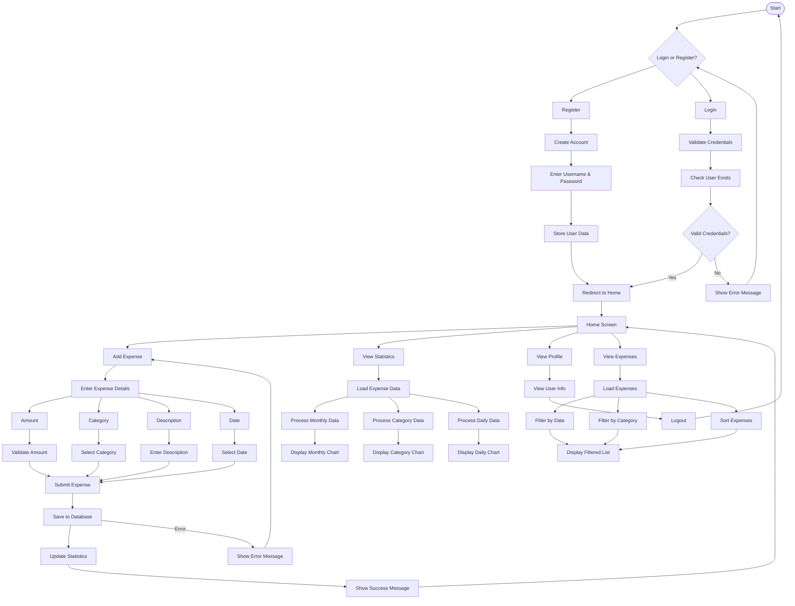

```mermaid
flowchart TD
    A(["Start"])
    A --> B{Login or Register?}
    B --> C["Register"]
    B --> D["Login"]

    C --> E["Create Account"]
    D --> F["Validate Credentials"]

    E --> G["Enter Username & Password"]
    F --> H["Check User Exists"]

    G --> I["Store User Data"]
    H --> J{Valid Credentials?}

    I --> K["Redirect to Home"]
    J -->|Yes| K
    J -->|No| L["Show Error Message"]

    %% Main Navigation Flow
    K --> M["Home Screen"]
    M --> N["Add Expense"]
    M --> O["View Statistics"]
    M --> P["View Profile"]
    M --> Q["View Expenses"]

    %% Add Expense Flow
    N --> R["Enter Expense Details"]
    R --> S["Amount"]
    R --> T["Category"]
    R --> U["Description"]
    R --> V["Date"]

    S --> W["Validate Amount"]
    T --> X["Select Category"]
    U --> Y["Enter Description"]
    V --> Z["Select Date"]

    W --> AA["Submit Expense"]
    X --> AA
    Y --> AA
    Z --> AA

    AA --> AB["Save to Database"]
    AB --> AC["Update Statistics"]
    AC --> AD["Show Success Message"]
    AD --> M

    %% Statistics Flow
    O --> AE["Load Expense Data"]
    AE --> AF["Process Monthly Data"]
    AE --> AG["Process Category Data"]
    AE --> AH["Process Daily Data"]

    AF --> AI["Display Monthly Chart"]
    AG --> AJ["Display Category Chart"]
    AH --> AK["Display Daily Chart"]

    %% Profile Flow
    P --> AL["View User Info"]
    AL --> AM["Logout"]
    AM --> A

    %% View Expenses Flow
    Q --> AN["Load Expenses"]
    AN --> AO["Filter by Date"]
    AN --> AP["Filter by Category"]
    AN --> AQ["Sort Expenses"]

    AO --> AR["Display Filtered List"]
    AP --> AR
    AQ --> AR

    %% Error Handling
    L --> B
    AB -->|Error| AS["Show Error Message"]
    AS --> N
``` 